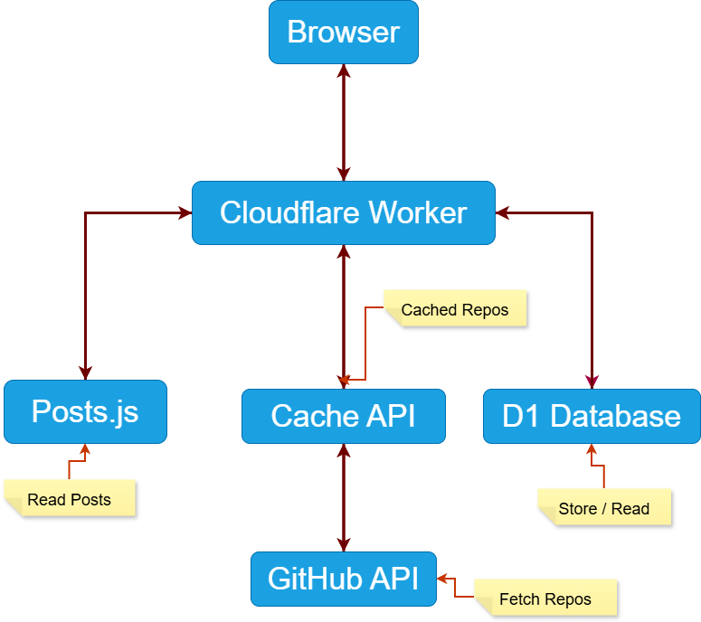

# High Level Design (Extension 2)

## Overview

This extension introduces two main capabilities:

1. A documented JSON API for blog content.
2. Integration with the GitHub REST API to display live repositories.

The application runs entirely on Cloudflare Workers.

---

## Components

### Browser

Responsible for:

- Rendering portfolio pages
- Fetching blog data from the Worker API
- Fetching GitHub repositories through the Worker

### Cloudflare Worker

Responsible for:

- Serving static frontend assets
- Exposing JSON API endpoints
- Calling external services
- Returning consistent JSON responses

### Blog Data Store

Source:

src/data/posts.js

Responsible for:

- Storing blog metadata
- Storing blog content
- Providing data to /api/posts endpoints

### GitHub API

External service:

https://api.github.com

Responsible for:

- Providing live repository information

### Cloudflare D1

Responsible for:

- Contact form submissions
- Guestbook messages

---

## Component Diagram

See diagram below.

