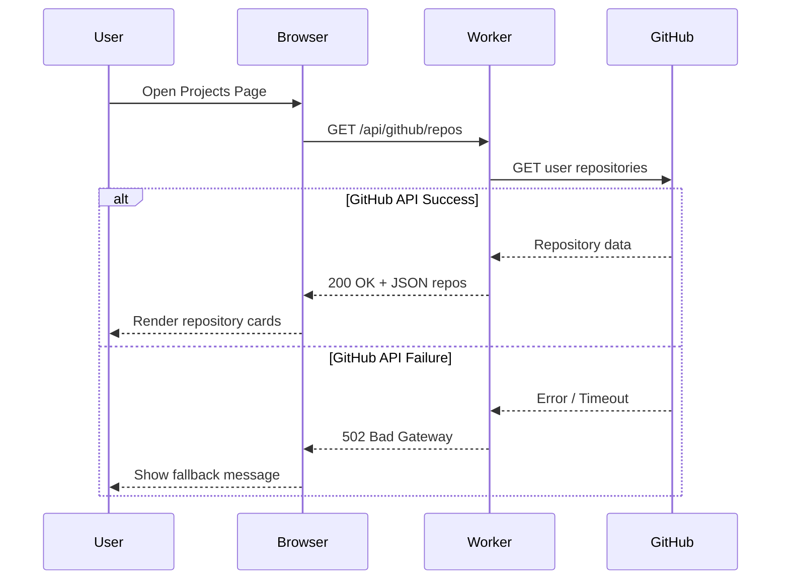

# Sequence Diagram

## GitHub Repository Integration

```mermaid
sequenceDiagram

participant User
participant Browser
participant Worker
participant GitHub

User->>Browser: Open Projects Page

Browser->>Worker: GET /api/github/repos

Worker->>GitHub: GET user repositories

alt GitHub API Success

    GitHub-->>Worker: Repository data

    Worker-->>Browser: 200 OK + JSON repos

    Browser-->>User: Render repository cards

else GitHub API Failure

    GitHub-->>Worker: Error / Timeout

    Worker-->>Browser: 502 Bad Gateway

    Browser-->>User: Show fallback message

end
```